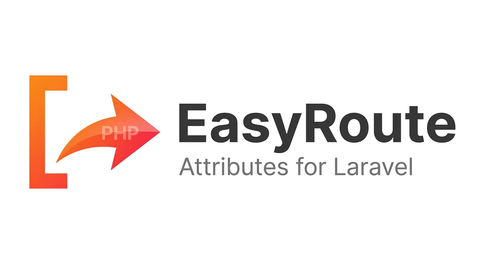
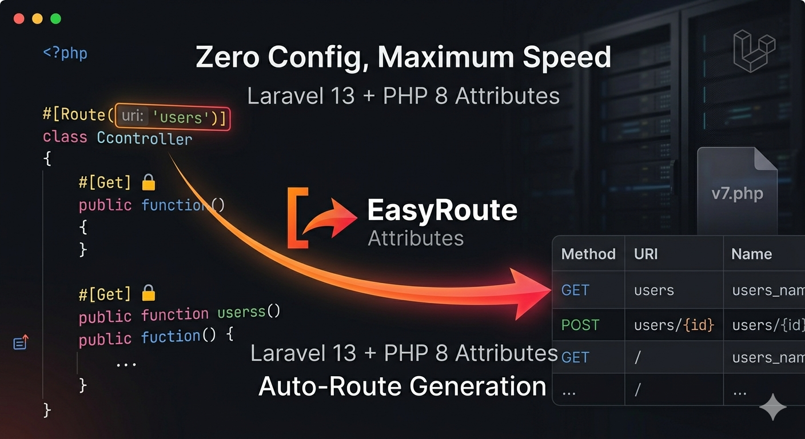
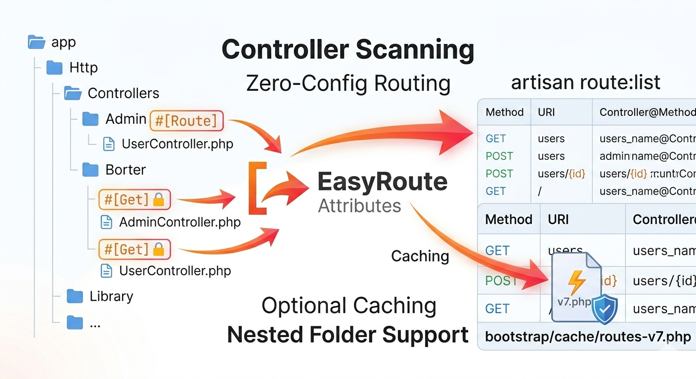

<p align="center">
  
</p>

# 🌟 Laravel G4T easyRoute Attributes for Laravel 13

A **Laravel 13 package** that lets you define routes using **PHP 8 attributes** with full support for Controller-level routes, Method-level routes, middleware, subfolders, and caching via Laravel’s `routes-v7.php`.  

<p align="center">
  
</p>

---

## 🚀 Features

- Controller-level route attributes (`#[Route(uri: 'users')]`)  
- Method-level route attributes (`#[Get]`, `#[Post]`, `#[Put]`, `#[Patch]`, `#[Delete]`, `#[Any]`)  
- Auto route generation using method names or `onController` option  
- Middleware support (controller-level + method-level)  
- Nested folder support for controllers  
- Route caching using Laravel compiled routes (`bootstrap/cache/routes-v7.php`)  
- Configurable Controllers paths  

---

## ⚙️ Installation

Install via Composer:

```bash
composer require g4t/easyroute
```

Publish config:

```bash
php artisan vendor:publish --provider "G4T\EaseRoute\EaseRouteServiceProvider"
```

This creates `config/route-attribute.php`:

```bash
return [
    'controllers_path' => [app_path('Http/Controllers')],
    'cache' => true,
];
```

📝 Usage
Controller-level Route

```php
<?php

namespace App\Http\Controllers;

use G4T\EaseRoute\Attributes\Route;
use G4T\EaseRoute\Attributes\Get;
use G4T\EaseRoute\Attributes\Post;

#[Route(uri: 'users', middleware: ['auth'])]
class UserController extends Controller
{
    #[Get]
    public function index()
    {
        return "List of users";
    }

    #[Get(onController: true)]
    public function show($id)
    {
        return "User: $id";
    }

    #[Post('create')]
    public function store()
    {
        return "Create user";
    }
}
```

## Supported HTTP Methods

| Attribute | HTTP Method   |
|-----------|---------------|
| #[Get]    | GET           |
| #[Post]   | POST          |
| #[Put]    | PUT           |
| #[Patch]  | PATCH         |
| #[Delete] | DELETE        |
| #[Any]    | Any method    |

⚡ Route Caching

To improve performance, EasyRoute can use Laravel compiled routes instead of scanning controllers for every request.

<p align="center">
  
</p>

Steps:
1. Ensure cache is enabled in `config/route-attribute.php`:

```php
'cache' => true
```

2. Run the caching command:
```php
php artisan route:cache
```

⚙️ Configuration

```php
return [
    'controllers_path' => [app_path('Http/Controllers')],
    'cache' => true,
];
```

- `controllers_path` → Array of paths where your controllers reside
- `cache` → Use cached routes from routes-v7.php

📝 Notes
Supports nested folders in controllers_path.

Use `onController: true` to auto-generate URI based on Controller and Method names.

Middleware is merged: `controller-level` + `method-level`.

Fully compatible with Laravel 13 attributes syntax.

```php
GET      users                          UserController@index
GET      user/show/{id}                 UserController@show
POST     users/create                    UserController@store
```

```php
app/
├─ Http/
│  ├─ Controllers/
│  │  ├─ UserController.php
│  │  └─ Admin/
│  │     └─ AdminController.php
bootstrap/
└─ cache/
   └─ routes-v7.php
config/
└─ route-attribute.php
```

✅ Notes for Developers
- Place your controllers inside controllers_path
- Add #[Route(...)] at the class level
- Add #[Get], #[Post], etc. at method level
- Use onController: true for automatic route naming
Run `php artisan route:cache` to generate cached routes

EasyRoute makes your Laravel 13 routing modern, clean, and high-performance.
